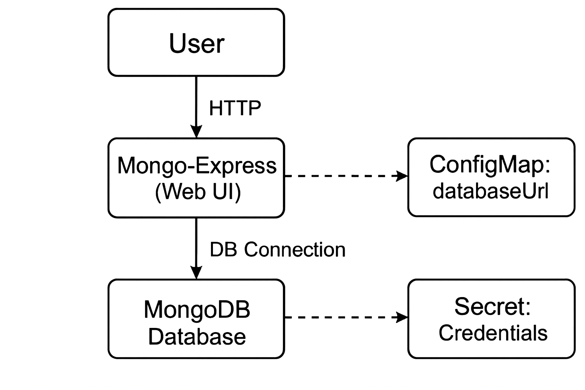

# Simple MongoDB and Mongo-Express Deployment using Kubernetes


## Overview
This guide demonstrates a basic deployment of **MongoDB** and **Mongo-Express** on Kubernetes using **Minikube**.  
It sets up a MongoDB database and a Mongo-Express web interface for managing the database.

---

## Architecture Diagram



---

## Components Used

- **Deployments**  
  - `mongodb` (Database)  
  - `mongo-express` (Web UI)  

- **Services**  
  - **Internal Service** → For communication between Web UI and Database  
  - **External Service** → For external consumers to access the Web UI  

- **Secret**  
  - Stores database and Web UI credentials securely  

- **ConfigMap**  
  - Dynamically stores `databaseUrl` for Web UI to connect to MongoDB  

---

## Commands (Using Minikube)

```bash
# Start and initiate the virtual Kubernetes cluster
minikube start

# Check the current resources running on your Kubernetes cluster
kubectl get all

# Deploy secrets (must be applied first for other components to access)
kubectl apply -f mongo-secret.yaml

# Deploy MongoDB and its internal service
kubectl apply -f mongodb-deployment.yaml

# Deploy ConfigMap containing DB URL for Web UI
kubectl apply -f mongo-configmap.yaml

# Deploy Mongo-Express (Web UI) connected to MongoDB
kubectl apply -f mongo-express-deployment.yaml

# Verify resources again
kubectl get all

# Access the Mongo-Express web interface
minikube service mongo-express-service
