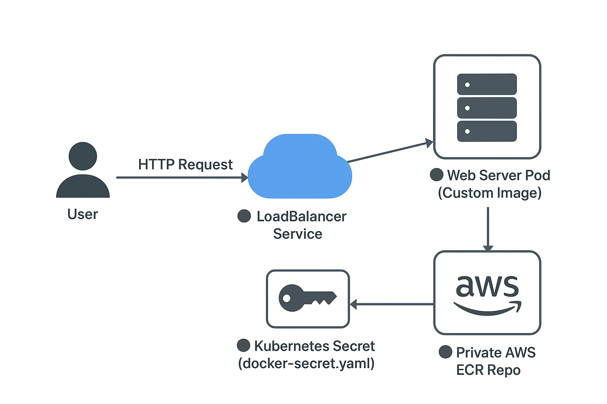

# 🌐 Simple Web Server with Custom Container Image (AWS ECR + Kubernetes)


## Overview
This project demonstrates deploying a **Web Server** on Kubernetes using a **custom container image** pulled securely from a **private AWS ECR repository**.

---

## Architecture Diagram



---

## ⚙️ Components Used

- **Deployment** → 📦 Web Server Pod  
- **Service** → 🌍 LoadBalancer (for external access)  
- **Secret** → 🔐 Stores AWS ECR credentials for pulling the private container image  

---

## Commands (Using Minikube)

```bash
# 1. Start and initiate the virtual Kubernetes cluster
minikube start

# 2. Check current resources running in your Kubernetes cluster
kubectl get all

# 3. Deploy the secret (must be applied first for image pull access)
kubectl apply -f docker-secret.yaml

# 4. Deploy the Web Server (Deployment + LoadBalancer Service)
kubectl apply -f web-deployment.yaml

# 5. Verify resources again
kubectl get all

# 6. Access the Web Interface
minikube service nginx-service